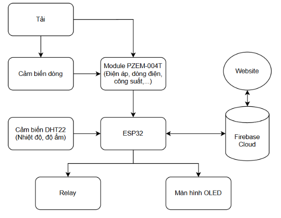
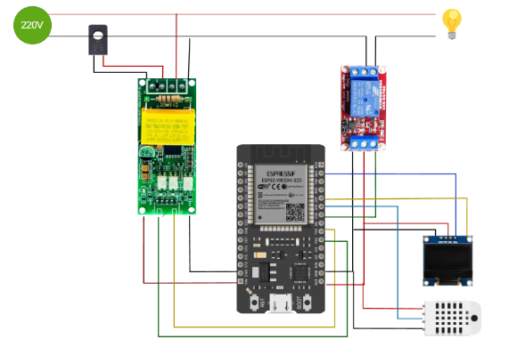
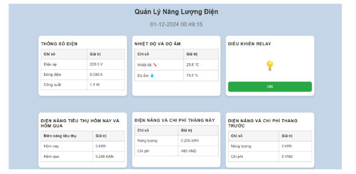
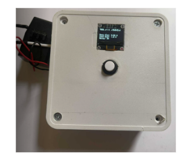

# ⚡ Thiết Bị IoT Giám Sát Năng Lượng Điện

> **Đồ Án Cơ Sở 4** – Trường Đại học Công nghệ Thông tin & Truyền thông Việt – Hàn  
> Khoa Kỹ thuật Máy tính và Điện tử

---

## 📌 Giới Thiệu

Dự án xây dựng một hệ thống **giám sát năng lượng điện thông minh** dựa trên công nghệ IoT, giúp người dùng theo dõi và quản lý tiêu thụ điện năng theo thời gian thực từ bất kỳ đâu. Hệ thống đo đạc các thông số điện (điện áp, dòng điện, công suất), giám sát môi trường (nhiệt độ, độ ẩm), hiển thị trực tiếp trên màn hình OLED, đồng bộ lên **Firebase** và trực quan hóa qua **giao diện web**.

---


## 🎯 Mục Tiêu

- Đo lường và giám sát các thông số điện: điện áp, dòng điện, công suất, hệ số công suất.
- Theo dõi điều kiện môi trường: nhiệt độ và độ ẩm.
- Hiển thị dữ liệu thời gian thực trên màn hình OLED và giao diện web.
- Tính toán chi phí tiêu thụ điện theo bậc thang giá điện.
- Cảnh báo và phòng ngừa sự cố thiết bị điện.
- Điều khiển relay từ xa qua website.

---

## 🏗️ Kiến Trúc Hệ Thống

<p align="center">
  <!-- Thêm ảnh sơ đồ khối hệ thống (Hình 3.1 trong báo cáo) -->
  
  <br/>
  <em>Sơ đồ khối hệ thống IoT giám sát năng lượng điện</em>
</p>

Luồng dữ liệu trong hệ thống:

```
Nguồn điện AC 220V
        │
        ▼
  Module PZEM-004T ──────────────────┐
  (Đo V, I, P, Wh)                   │
        │ UART                        │
        ▼                             │
      ESP32  ◄──── DHT22              │
   (Xử lý trung tâm)  (Nhiệt độ/Độ ẩm) │
        │                             │
     ┌──┴──┐                          │
     │     │                          │
     ▼     ▼                          │
  OLED   Relay ◄──────────────────────┘
 (Hiển  (Điều khiển
  thị)   thiết bị)
     │
     ▼
 Firebase Realtime DB
     │
     ▼
 Website giám sát
```

---

## 🛠️ Công Nghệ Sử Dụng

### Phần mềm & Nền tảng

| Công nghệ | Mô tả |
|-----------|-------|
| **Arduino IDE** | Lập trình vi điều khiển ESP32 (C/C++) |
| **Visual Studio Code** | Phát triển giao diện web |
| **Firebase Realtime DB** | Lưu trữ và đồng bộ dữ liệu thời gian thực |
| **HTML / CSS / JavaScript** | Xây dựng giao diện web giám sát |

### Phần cứng & Linh kiện

| Linh kiện | Chức năng |
|-----------|-----------|
| **ESP32** | Vi điều khiển trung tâm, WiFi + Bluetooth, lõi kép 240MHz |
| **PZEM-004T** | Đo điện áp (80–260V AC), dòng điện, công suất, điện năng |
| **DHT22** | Đo nhiệt độ (−40°C ~ 80°C) và độ ẩm (0–100%) |
| **OLED SSD1306** | Màn hình hiển thị 128×64px, giao tiếp I2C |
| **Relay Module** | Điều khiển bật/tắt thiết bị điện từ xa qua GPIO |

---

## 🔌 Sơ Đồ Kết Nối Phần Cứng

<p align="center">
  <!-- Thêm ảnh sơ đồ lắp đặt phần cứng (Hình 3.2 trong báo cáo) -->
  
  <br/>
  <em>Sơ đồ lắp đặt hệ thống IoT giám sát năng lượng điện</em>
</p>

| ESP32 GPIO | Kết nối với | Giao thức |
|------------|-------------|-----------|
| GPIO 18 | Relay Module (điều khiển tải) | Digital Output |
| GPIO 19 | DHT22 (dữ liệu nhiệt độ/độ ẩm) | Single-wire |
| GPIO 21 (SDA) | OLED SSD1306 – SDA | I2C |
| GPIO 22 (SCL) | OLED SSD1306 – SCL | I2C |
| RX / TX | PZEM-004T | UART |
| 3.3V | OLED VCC | Nguồn |
| 5V / USB | Nguồn ESP32 & PZEM-004T | Nguồn |

---

## ⚙️ Cài Đặt & Chạy Dự Án

### Yêu cầu
- Arduino IDE (đã cài đặt board ESP32)
- Tài khoản Firebase
- Các thư viện Arduino cần cài:
  - `FirebaseESP32`
  - `PZEM-004T-10`
  - `DHT sensor library`
  - `Adafruit SSD1306`
  - `Adafruit GFX Library`

### 1. Clone repository
```bash
git clone https://github.com/NgocCa2506/IoT_giam_sat_nang_luong_dien.git
cd IoT_giam_sat_nang_luong_dien
```

### 2. Cấu hình Firebase
Truy cập [Firebase Console](https://console.firebase.google.com) → tạo project mới → **Realtime Database** → lấy `Firebase Host` và `Auth Key`.

### 3. Cập nhật thông tin kết nối trong code

```cpp
#define WIFI_SSID     "TÊN_WIFI_CỦA_BẠN"
#define WIFI_PASSWORD "MẬT_KHẨU_WIFI"
#define FIREBASE_HOST "your-project-default-rtdb.firebaseio.com"
#define FIREBASE_AUTH "your-firebase-auth-key"
```

### 4. Nạp code lên ESP32
Mở file `.ino` bằng Arduino IDE → chọn đúng board **ESP32 Dev Module** và cổng COM → nhấn **Upload**.

### 5. Triển khai Website
Mở thư mục `website/` và chạy với Live Server, hoặc deploy lên GitHub Pages / Firebase Hosting.

---

### Cấu trúc dữ liệu Firebase

```
/readings
  ├── energy_Today         (kWh hôm nay)
  ├── energy_Yesterday     (kWh hôm qua)
  ├── energy_This_Month    (kWh tháng này)
  ├── energy_Last_Month    (kWh tháng trước)
  ├── cost_This_Month      (chi phí tháng này - VNĐ)
  ├── cost_Last_Month      (chi phí tháng trước - VNĐ)
  ├── voltage              (V)
  ├── current              (A)
  ├── power                (W)
  ├── temperature          (°C)
  └── humidity             (%)
```

---

## 🖥️ Giao Diện Website Giám Sát

<p align="center">
  <!-- Thêm ảnh giao diện website (Hình 3.10 trong báo cáo) -->
  
  <br/>
  <em>Giao diện Website giám sát năng lượng điện</em>
</p>

Giao diện web bao gồm các bảng thông tin:

| Bảng | Nội dung |
|------|----------|
| **Thông số điện** | Điện áp (V), dòng điện (A), công suất tiêu thụ (W) |
| **Nhiệt độ và độ ẩm** | Dữ liệu môi trường từ DHT22 |
| **Điều khiển Relay** | Bật/tắt thiết bị từ xa qua nút ON/OFF |
| **Điện năng hôm nay / hôm qua** | So sánh mức dùng điện theo ngày |
| **Điện năng và chi phí** | Thống kê và chi phí tháng này / tháng trước |

---

## 📦 Sản Phẩm Thực Tế

<p align="center">
  <!-- Thêm ảnh sản phẩm thực tế (Hình 3.6 trong báo cáo) -->
  
  <br/>
  <em>Mô hình thiết bị IoT giám sát năng lượng điện hoàn chỉnh</em>
</p>

---

## 📊 Kết Quả Đạt Được

- ✅ Đo và hiển thị thời gian thực: điện áp, dòng điện, công suất, điện năng tiêu thụ
- ✅ Giám sát nhiệt độ và độ ẩm môi trường bằng DHT22
- ✅ Hiển thị thông số trực tiếp trên màn hình OLED
- ✅ Đồng bộ dữ liệu lên Firebase Realtime Database qua WiFi
- ✅ Tính toán chi phí điện tự động theo bậc thang EVN (6 bậc)
- ✅ Giao diện web giám sát và điều khiển relay từ xa
- ✅ Thống kê điện năng theo ngày và tháng

---

## 🚀 Hướng Phát Triển

- Tích hợp học máy (Machine Learning) để dự đoán xu hướng tiêu thụ điện
- Kết nối với hệ thống năng lượng tái tạo (pin mặt trời, điện gió)
- Phát triển ứng dụng mobile (Android/iOS)
- Mở rộng sang môi trường công nghiệp, tòa nhà thông minh
- Tăng cường bảo mật với SSL/TLS và xác thực người dùng
- Gửi cảnh báo qua email / thông báo đẩy khi phát hiện bất thường

---

## 📚 Tài Liệu Tham Khảo

1. Firebase Console – [https://console.firebase.google.com](https://console.firebase.google.com)
2. YouTube – Hướng dẫn PZEM-004T: [https://www.youtube.com/watch?v=eGhvxbVpNY0](https://www.youtube.com/watch?v=eGhvxbVpNY0)
3. YouTube – Electronics Simplified: [https://www.youtube.com/watch?v=B10HWeXouIg](https://www.youtube.com/watch?v=B10HWeXouIg)
4. IoT trong giám sát năng lượng thông minh: [https://viettechinvest.vn](https://viettechinvest.vn/ung-iot-trong-giam-sat-nang-luong-thong-minh)

---

## 📄 Bản Quyền

Dự án được thực hiện phục vụ mục đích học thuật tại Trường Đại học Công nghệ Thông tin & Truyền thông Việt – Hàn.

---

<p align="center">
  Made with ❤️ by <strong>Nguyễn Ngọc Ca</strong> – VKU 2024
</p>